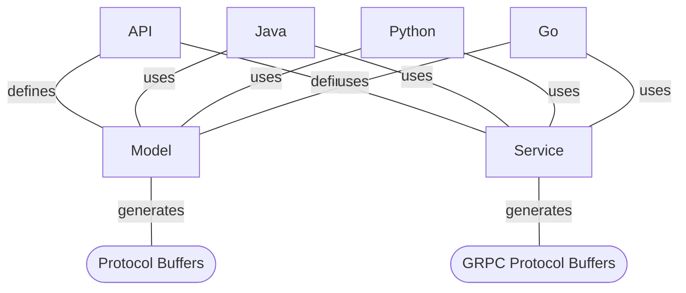

# Google Retail Data Model

> The Retail Data Model is under development and SHOULD NOT be used in production
> environments until the 1.0.0 release.

Google Retail Data Model (RDM) is a set of model and service definitions grouped
by operational boundaries called modules. The purpose of the API is to 
provide a concrete, extensible, and simplified version of the Association 
of Retail Technology Solutions (ARTS) [Operational Data Model (ODM)](https://www.omg.org/retail-depository/arts-odm-73/) 
7.3 targeting modern, cloud data sources and service infrastructure.

The Google Retail Data Model is specified using the following requirements
language based on [RFC-2119](https://datatracker.ietf.org/doc/html/rfc2119):

1. All definitions MUST be written in Protocol Buffer 3 and MUST NOT limit adoption by multiple programming languages.
2. The API MUST be defined in such a way that it MAY be extended by retailers.
3. The API MAY NOT contain all definitions for all retail types and services.
4. The API MUST be divided into modules allowing a retailer to use as much or as little as they require.
5. The API modules MAY depend on one another but MUST NOT depend on external resources unless they are fully captured in the third_party directory.
6. The API SHOULD NOT require a specific implementation, but SHOULD provide RECOMMENDED guidance for the intention of the definitions via documentation and annotated with the RECOMMENDED key word.

## Build Hierarchy

## Modules Definitions and Relationships

* **Enums** - A set of common, standard, enumerated values used as adjectives to
  refine entity descriptions. Such as: country code, language code, etc.
* **Common** - A common set of definitions used by multiple modules. This includes
  constructs like Address, Phone, Country, etc.
* **Enterprise** - A set of definitions related to enterprise general ledger,
  assets, the human workforce, and hierarchies.
* **Location** - A set of definitions for describing physical, movable, and virtual
  locations. E.g. Site, Store, Warehouse, etc.
* **Party** - A set of definitions used for abstracting business and human
  relationships and understanding their change history over time. E.g.
  household, organization, membership, etc.
* **Customer** - A set of definitions used to describe a human or business customer
  and their journey to becoming a customer. E.g. anonymous customer,
  key customer, multi-channel customer etc.
* **Merchandise** - A set of definitions used to describe Product, Vendor, Pricing,
  Cost, Hierarchy, Hierarchy Pricing and Taxation Rules.
* **Inventory** - A set of definitions used to describe master inventory, assorted
  inventory, locational awareness, receiving, and stock.
* **Events** - A set of definitions used for describing events that MAY or MAY NOT
  support transactional flows. Events are used to enable performance indicators
  and represent near-real-time observability.
* **Transactions** - A set of definitions used to describe transactional events
  such as POS sales, Returns, Inventory Change Control, Cross Dock, etc.
  These definitions represent near-real-time observability and decision-making.
* **Supply Chain** - A set of definitions used for describing the distribution
  network used by a retailer
* **Payments** - A set of definitions used to describe payment account types such as
  gift cards, line of credit, etc. and the relationship to GL structures.

### Module Dependencies
|              | Enums | Common | Enterprise | Location | Party | Customer | Merchandise | Inventory | Events | Transactions | Supply Chain | Payments |
|--------------|-------|--------|------------|----------|-------|----------|-------------|-----------|--------|--------------|--------------|----------|
| Enums        |       |        |            |          |       |          |             |           |        |              |              |          |   
| Common       | X     |        |            |          |       |          |             |           |        |              |              |          |
| Events       |       | X      |            |          |       |          |             |           |        |              |              |          |
| Enterprise   | X     | X      |            |          |       |          |             |           | O      | X            |              |          |
| Location     | X     | X      | X          |          |       |          |             |           | O      |              |              |          |
| Party        | X     | X      | X          | X        |       |          |             |           | O      | X            |              |          |
| Customer     | X     | X      | X          | X        | X     |          |             |           | O      | X            |              |          |
| Merchandise  | X     | X      | X          | X        | X     |          |             |           | O      | X            |              |          |
| Inventory    | X     | X      | X          | X        |       |          | X           |           | O      | X            |              |          |
| Transactions | X     | X      | X          | X        | X     |          | X           |           | O      |              |              |          |
| Supply Chain | X     | X      | X          | X        | X     |          | X           | X         | O      | X            |              |          |
| Payments     | X     | X      | X          | X        | X     |          |             |           | O      |              |              |          |

* X - Required
* O - Optional / Recommended

## Documentation Site

> The documentation site is currently not published as this is a private repository.
> This will change once public.

[Documentation Site](https://GoogleCloudPlatform.github.io/retail-data-model/)

## Project Directories

* [APIs](api/README.md) - The interfaces and service descriptions.
* [Go](go/README.md) - The Go build and test examples.
* [Java](java/README.md) - The Java build and test examples.
* [Python](python/README.md) - The Python build and test examples.

## Contributing

* [Contribution Guide](docs/content/en/contributing/_index.md)
* [Code of conduct](docs/content/en/contributing/code_of_conduct.md)
* [Style guide](docs/content/en/contributing/code_style_guide.md)
* [Tool chain](docs/content/en/toolchain/tools.md)

## License - Apache 2.0

This project is licensed under the Apache 2.0 license model. Please review
the [LICENSE](LICENSE) file.

### Contributors

Open Source is only possible by the dedication of the developers and companies
willing to devote the time required to make reusable software. A sincere
thank you for the participation and contributions from the named contributors:

[Contributors](docs/content/en/contributing/contributors.md)

