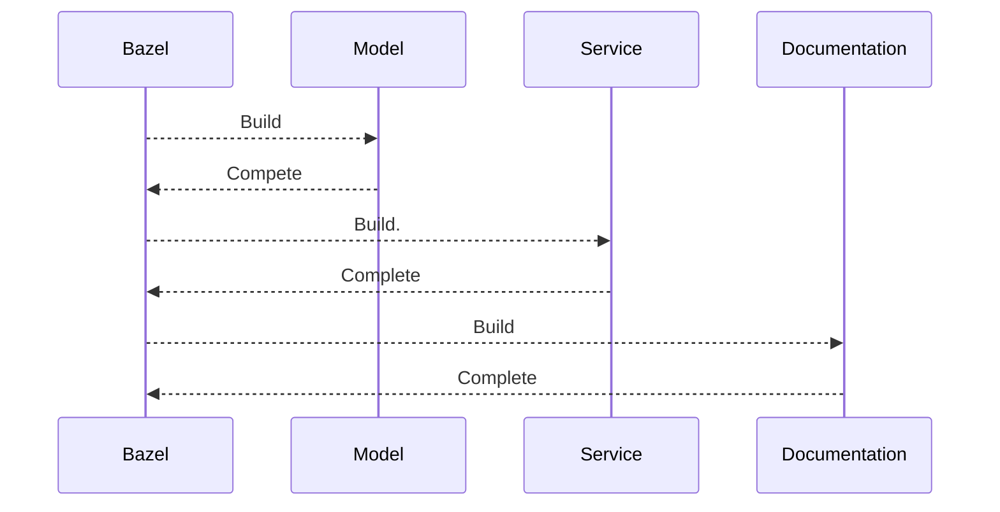

# API

The API directory contains the modules of the Google Retail Cloud.
Each top-level directory indicates a module. Please see the 
primary [README](../README.md) to understand what is in each module.

## Building

```shell
$ bazel build //api/...
```

## Build Steps
The API build is a pass fail build. The build for each module
follows the same steps:



