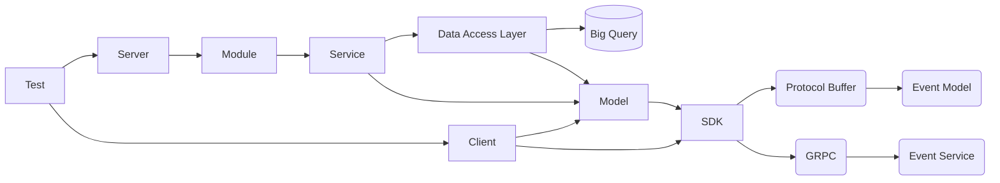

# Packages

Each package represents an individual layer of functionality found in most
modern applications.

### Package Descriptions

* Model - Extensions related to the protobuf definitions. Such as creators and utility methods.
* Data Access Layer (DAO) - The data access objects used by the service layer for persisting data.
* Service - The business logic layer.
* Module - Is the unifying unit responsible for the creation and life-cycle of services, DAOs, and the model.
* Server - Is the protocol listener and broker layer.
* Client - Is an embeddable client library for using the services over a protocol with little effort.
* Command - Is a wrapper for the server, allowing it to be natively constructed for running on operating systems.

## Dependencies

