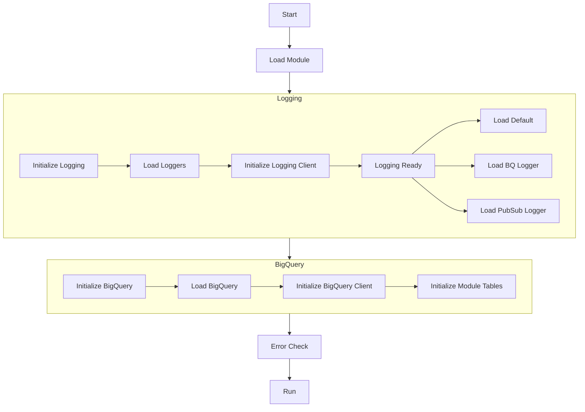

# Retail

The retail module is the base extensible module for all other Go Modules.
The Retail module implements the life-cycle and configuration objects 
required to start and stop all module types.

Life-Cycle

